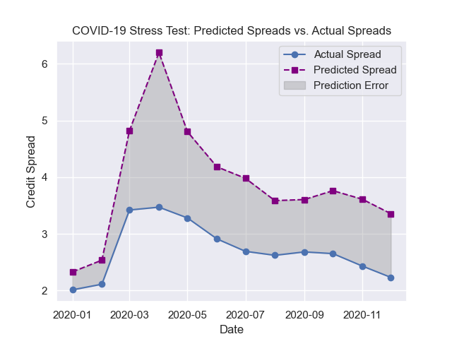

# Credit Spread Analysis

Credit spreads are commonly defined as the difference between a corporate bond yield and a government bond yield with a similar maturity, representing the markets perceived risk associated with the corporate issuer. This project aims to analyse and understand what drivers influence the credit spreads, and then conduct a stress test during a modern stress event (COVID-19).  

## Project Overview

This project takes on a learning-focused and exploratory approach to market risk analysis; exploring how macroeconomic and market-based factors influence movements in credit spreads. This includes:
- Data contructing & feature engineering
    - Year-on-year (YoY) changes and, compounding daily market returns into monthly returns
- EDA on credit spreads: inclduing correlation comparisons during calm and stressed periods
- Coefficient comparison between models trained in calm vs stressed regimes
- Stress test: assesed how a model behaves when tested during COVID-19


## Dataset

- **Source:** Extracted using `fredapi` (macroeconomic data) and `yfinance` (market data)
- **Description:** Monthly macroeconomic and market data from 2000 - 2025
- **Size:** 310 monthly observations


## FRED API Setup

This project uses the FRED API for macroeconomic data. To run the notebooks, you **need** an API key. You can get your free API key here: [FRED API key](https://fred.stlouisfed.org/docs/api/api_key.html), then store it in an environment variable called `FRED_API_KEY`.

**Option 1 (Reccomended): `.env` file**
1. Create a file called `.env` in the project root
2. Add this line in the file:
```
FRED_API_KEY=your_key_here
```
(replace `your_key_here` with your API key)

**Option 2: Set environment variable manually**

For Windows (PowerShell):
```powershell
$env:FRED_API_KEY="your_key_here"
```

For macOS/ Linus:
```bash
export FRED_API_KEY="your_key_here"
```


## How To Run

**Requirements:**
- Python 3.x
- Libraries: `pandas`, `matplotlib`, `seaborn`, `sklearn`, `fredapi`, `yfinance`
- FRED API key
- Any Jupyter Notebook environment

**Steps:**

1. Clone this repository
```
git clone https://github.com/TounseA/credit-spread-analysis.git
```

2. Optional: Install dependencies
```
pip install -r requirements.txt
```

3. Run the notebooks in this order:
    1. `credit_spread_analysis.ipynb` (dataset contruction & analysis)
    2. `covid_case_study.ipynb` (COVID-19 stress test)


## Key Findings

**Analysis:**
- Found four major periods of significant credit spread widening were identified and mapped to real-world events (e.g. the dot-com crash, the 2008 financial crisis, and COVID-19).
    - Highlighting the role of systemic economic and market stress in spread behaviour. 
- During calm market conditions, policy-related factors (such as interest rate levels) emerged as the strongest drivers of credit spreads.
    - In contrast, during stressed regimes, spreads were more strongly influenced by macroeconomic deterioration and market sentiment variables, including industrial production, unemployment, and market volatility (VIX).

**Stress Test:**
- A linear regression model was trained on data from 2000-2019, and was stress-tested on the 2020 COVID-19 period.
    - Model was observed to *overestimate* spread values.
- While the model struggled to predict the magnitude of spread widening, it was able to capture the overall directional movement of spreads.
- It is hypothesised that historical stress events (e.g., 2008 financial crisis) had influenced the models behaviour.
    - Suggesting the model may have predicted what spreads *could* have looked like under similar levels of stress, assuming limited interventions from governments, central banks or financial institutions.

<p align='center'>
    
</p>

---


> Disclaimer: This project is for educational purposes only, and is not financial advise. 
